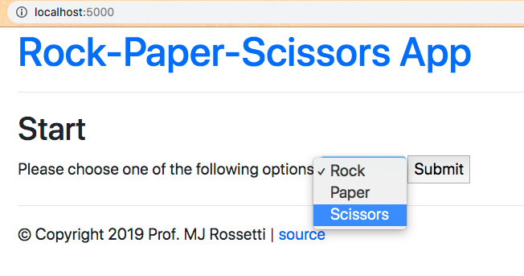
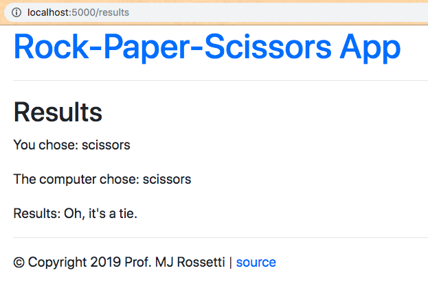

# Rock-Paper-Scissors App (Flask)

A basic game written in Python and implemented as a web application using the Flask package.





## Prerequisites

  + Anaconda 3.7
  + Python 3.7
  + Pip

## Installation

Fork the repository from [GitHub source](https://github.com/prof-rossetti/rock-paper-scissors-flask).

Then use GitHub Desktop or the command-line to "clone" or download your fork onto your local computer:

```sh
git clone https://github.com/YOUR_USERNAME/rock-paper-scissors-flask.git # this is the HTTP address, but you could alternatively use the SSH address
```

Navigate into your local repo from the command-line before running any of the other commands below:

```sh
cd rock-paper-scissors-flask
```


## Setup

Create and activate a new Anaconda virtual environment:

```sh
conda create -n rps-flask-env python=3.7 # first time only
conda activate rps-flask-env
```

Install Python package dependencies:

```sh
pip install -r requirements.txt
```

## Usage

Run a local web server, then view your app in a browser at http://localhost:5000/:

```sh
# Mac Terminal or Windows Git Bash:
FLASK_APP=web_app flask run

# Windows Command Prompt:
set FLASK_APP=web_app
flask run
```

> NOTE: you can quit the server by pressing ctrl+c at any time. If you change a file, you'll likely need to restart the server for the changes to take effect.

# [License](/LICENSE.md)
